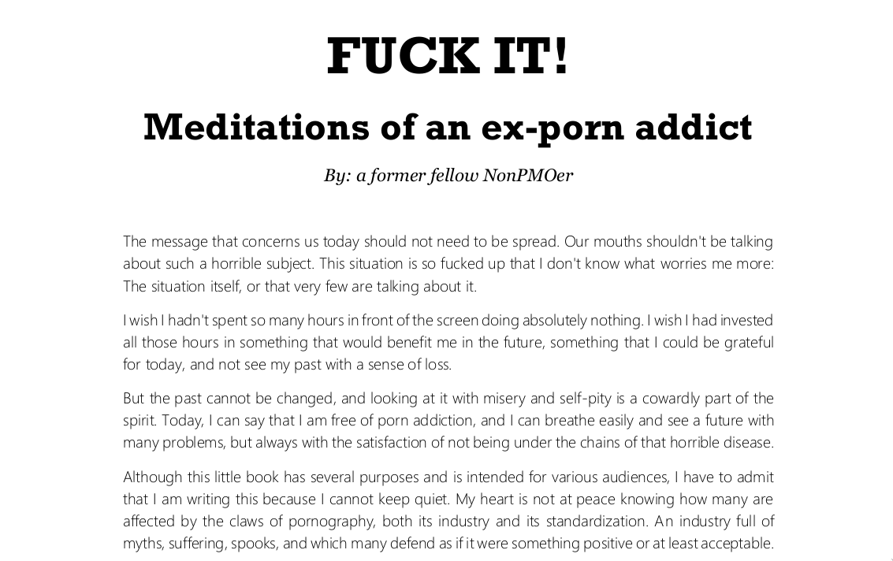
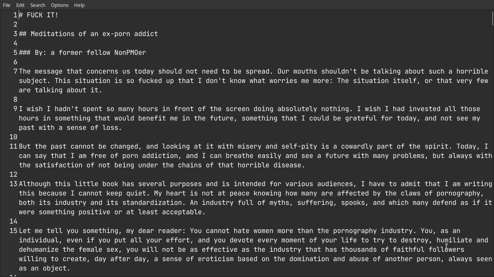

# PDF to Formatted Markdown CLI (pdf2md)

Công cụ CLI viết bằng Python, giúp chuyển đổi PDF dạng digital (có text layer và metadata font) sang Markdown sạch, có cấu trúc rõ ràng.

Ví dụ, đây là một trang PDF chẳng hạn:



Output sẽ kiểu như này:



*Tất nhiên là do bản thân PDF này nó đã sạch rồi nên chuyển đổi trông output markdown nhìn cực ưng ý*

## Tổng quan

Dự án này cung cấp một pipeline chuyển đổi hai bước (two-pass) được thiết kế để chuyển các tài liệu PDF dạng digital (như ebook, báo cáo hoặc tài liệu xuất từ Word) thành Markdown.

Hệ thống hoạt động hoàn toàn dựa trên phân tích bố cục (layout) theo tọa độ và thống kê văn bản. Nhờ không sử dụng các engine OCR nặng hoặc LLM, công cụ giữ được tính nhẹ, nhanh và an toàn. Chính vì thế nên là tính chính xác sẽ không được cao như LLM hay gì đâu nhé.

Các tính năng chính:

* **Phân tích Style Profiling**: Sử dụng thống kê để xác định font nội dung chính (body font) và các đặc trưng bố cục theo chiều dọc nhằm suy luận cấp độ tiêu đề (H1–H6) trên toàn bộ tài liệu.
* **Khôi phục bố cục bằng heuristic (Heuristic Layout Reconstruction)**: Ghép lại các đoạn văn bị xuống dòng do giới hạn trang PDF, phát hiện ranh giới đoạn văn trong cùng một block và sửa lỗi ngắt từ bằng dấu gạch nối mềm (soft hyphen).
* **Loại bỏ thành phần lặp lại (Boilerplate Removal)**: Phát hiện và loại bỏ số trang, tiêu đề đầu trang (running header) và chân trang (running footer) nằm trong vùng lề trên và dưới.
* **Nhận diện danh sách (Lists Detection)**: Phát hiện danh sách lồng nhau dạng bullet hoặc đánh số (số, chữ cái, số La Mã) dựa trên mức độ thụt lề.
* **Trích xuất bảng (Table Extraction)**: Sử dụng `pdfplumber` để trích xuất bảng và chuyển đổi sang bảng Markdown, đồng thời giữ đúng thứ tự đọc theo chiều dọc của tài liệu.

## Bắt đầu

### Yêu cầu

* Python 3.8 trở lên.
* Các thư viện Python: `pymupdf` (fitz), `pdfplumber` và `typer`.

### Cài đặt

1. Tải hoặc clone dự án về máy:

   ```bash
   git clone <repository_url> pdf2md-cli
   cd pdf2md-cli
   ```

2. Tạo môi trường ảo và cài đặt các thư viện phụ thuộc:

   ```bash
   python3 -m venv .venv
   source .venv/bin/activate  # Trên Windows dùng `.venv\Scripts\activate`
   pip install --upgrade pip
   pip install pymupdf pdfplumber typer pytest
   ```

### Sử dụng

**Chuyển PDF sang Markdown**

Chạy luồng chuyển đổi mặc định. Nếu không chỉ định file đầu ra, kết quả sẽ được ghi vào file `<ten_file_dau_vao>.md`.

```bash
python3 -m pdf2md input.pdf
```

**Chuyển PDF sang file Markdown tùy chỉnh**

```bash
python3 -m pdf2md input.pdf output.md
```

**Xuất Document Profile**

Hiển thị kích thước font nội dung chính và các kích thước font được xem là ứng viên tiêu đề dưới dạng JSON.

```bash
python3 -m pdf2md input.pdf --dump-profile
```

**Xuất danh sách tiêu đề đã phát hiện**

Hiển thị các tiêu đề cùng cấp độ tương ứng (H1, H2, H3, ...).

```bash
python3 -m pdf2md input.pdf --dump-headings
```

**Xuất thông tin phân loại block**

In ra danh sách JSON chứa toàn bộ các block văn bản đã trích xuất cùng thông tin phân loại để phục vụ debug.

```bash
python3 -m pdf2md input.pdf --dump-blocks
```

**Đại khái là kiểm thử**

```bash
PYTHONPATH=. pytest pdf2md/tests
```

## Trợ giúp

Một số vấn đề thường gặp:

* **PDF scan hoặc PDF OCR**: Nếu input PDF là tài liệu scan (không có text layer hoặc metadata font), công cụ có thể tạo ra tài liệu rỗng hoặc chỉ chứa các thành phần không mong muốn. Hãy đảm bảo PDF là tài liệu digital với văn bản có thể chọn được (selectable text).
* **Lỗi trích xuất bảng**: Nếu `pdfplumber` không thể phân tích bảng (ví dụ bảng không có đường viền hoặc có cấu trúc ô quá phức tạp), hệ thống sẽ thay thế bằng chuỗi `[TABLE DETECTED]` trong Markdown đầu ra.

Hiển thị toàn bộ tùy chọn CLI:

```bash
python3 -m pdf2md --help
```

## License

*Dự án này được phát hành theo giấy phép Unlicense. Xem file LICENSE để biết thêm chi tiết.*
